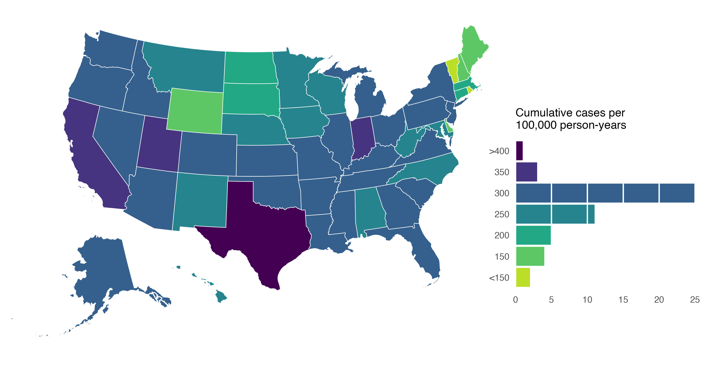

<!-- README.md is generated from README.Rmd. Please edit that file -->

# `modeling_reemergence`

<p align="center">

</p>

## Introduction

Reproducible code for our paper, “Modeling reemergence of
vaccine-eliminated infectious diseases under declining vaccination in
the United States”, which uses publicly-available data to simulate the
impact of changes in routine childhood vaccination on the re-emergence
of measles, rubella, diphtheria, and polio in the US.

### Abstract

**Importance**: Widespread childhood vaccination has eliminated many
infectious diseases in the United States. However, vaccination rates are
declining and there are ongoing policy debates to reduce the childhood
vaccine schedule, which may risk re-emergence of previously eliminated
infectious diseases.

**Objective**: To estimate the number of cases and complications in the
United States under scenarios of declining childhood vaccination for
measles, rubella, poliomyelitis, and diphtheria.

**Design, Setting, and Participants**: We used a simulation model that
simulates importation and dynamic spread of vaccine-preventable
infectious diseases in the US population across 50 states and the
District of Columbia. The model was parameterized with data on
area-specific estimates for demography, population immunity, and
infectious disease importation risk. We estimated the impact of
declining vaccination under different scenarios over a 25-year period.
Baseline inputs for childhood vaccination rates were based on data from
2004 – 2023.

**Main Outcomes and Measures**: Cumulative cases of measles, rubella,
poliomyelitis, and diphtheria in the United States. Secondary outcomes
included infection-related complications (post-measles neurological
sequelae, congenital rubella syndrome, paralytic poliomyelitis,
hospitalization, and death) and the probability and timing for an
infection to re-establish endemicity.

**Results**: At current state-level vaccination rates, the simulation
model predicts measles may re-establish endemicity (83% of simulations;
mean time of 20.9 years) with an estimated 851,300 cases (95%
uncertainty interval (UI): 381,300 – 1.3M) over 25 years. Under a
scenario with a 10% decline in MMR vaccination, the model estimates 11.1
million measles cases (10.1M – 12.1M) over 25 years, while a 5% increase
in MMR vaccination reduces cases to 5,800 (3,100 – 19,400). Other
vaccine-preventable diseases are unlikely to re-establish endemicity
under current levels of vaccination. If routine childhood vaccination
declined by 50%, the model predicts 51.2 million measles cases (49.7M –
52.5M), 9.9 million rubella cases (6.4M – 13.0M), 4.3 million
poliomyelitis cases (4.0 – 21.5M), and 197 diphtheria cases (1 – 1,000)
over a 25-year period. Under this scenario, we project 51,200 children
with post-measles neurological sequelae (49,600 – 52,600), 10,700
congenital rubella syndrome cases (6,700 – 14,600), 5,400 paralytic
poliomyelitis cases (0 – 26,300), 10.3 million hospitalizations (9.9M –
10.5M), and 159,200 deaths (151,200 – 164,700). In this scenario,
measles became endemic at 4.9 years (4.3 – 5.6) and rubella became
endemic at 18.1 years (17.0 – 19.6), while poliovirus returned to
endemic levels in about half of simulations (56%) and took over 19 years
to reach endemicity. There was large variation across states.

**Conclusions and Relevance**: Based on estimates from this modeling
study, declining childhood vaccination rates will increase the frequency
and size of outbreaks of previously eliminated vaccine-preventable
infections, eventually leading to their return to endemic levels. The
timing and critical threshold for returning to endemicity will differ by
disease, with measles likely to be the first to return to endemic levels
and may occur even under current vaccination levels without improved
vaccine coverage and public health response. These findings support the
need to continue routine childhood vaccination at high coverage to
prevent resurgence of vaccine-preventable infectious diseases in the
United States.

### Issues

Please report issues via email or the [issues
page](https://github.com/mkiang/modeling_reemergence/issues).

## Structure

This project is structured as follows:

- **`code`**: Contains all code used for this project. Designed to be
  run sequentially. A brief overview of the code files is provided
  below. More detailed information is provided at the beginning of most
  files.
- **`data`**: Contains processed data necessary to run the simulations
  and reproduce our tables and plots.
- **`data_raw`**: Contains all (publicly available) raw data necessary
  to run the analysis. Note that while we did our best to keep these
  files in their read-only original form, some files required editing to
  run. We have documented the edits carefully in the
  [`./data_raw/README.md`](./data_raw/README.md) file, which also
  provides links to the original sources and dates we accessed the
  links.
- **`output`**: Contains numerical representations (in `csv` format) of
  all primary figures.
- **`plots`**: Contains figures used the manuscript in `jpg` and `pdf`
  formats (and a few additional figures not used in the manuscript).
- **`rmds`**: Contains code to generate tables used in the manuscript.
- **`simulations`**: Contains all raw simulations (as parquet files).
  This folder is large (\>500GB) and *not saved on GitHub*. See the
  **Reproducibility** section for details on how to download our
  simulations.
- **`summaries`**: Summaries of the raw simulation files (e.g., mean,
  median, etc.) by state/vaccine scenario/pathogen. Similar to above,
  these simulation summary (parquet) files are not on GitHub — see the
  **Reproducibility** section for details on how to download these
  files.
- **`supp_analyses`**: Contains simulations and summaries for all the
  supplemental analyses (e.g., the probabilistic sensitivity analysis)
  as parquet files. Similar to above, the summary files are not on
  GitHub — see the **Reproducibility** section for details on how to
  download these files.
- **`temp_endemic_timing`** and **`temp_secondary_outcomes`** are
  temporary folders that holder intermediate results for the endemic
  timing and secondary outcomes analyses, respectively. They are
  generated during the analysis and can (optionally) removed after
  summarizing the results.

### `./code` folder

The analytic pipeline in the `./code`/ folder is designed to have each
file run sequentially. That is, each file performs a discrete task and
some tasks may be dependent on the output of previous tasks.

The files from `01` through `05` ingest the raw data. Files `06` and
`07` modify the raw data and creates the analytic data sets that will be
used for the simulation (e.g., initial immunity, death rates, birth
rates, etc.). Files `08` through `11` run and summarize the simulations
(`08` at the state level and `10` aggregates state simulations up to
national simulations). Files `12` and `13` calculate secondary results
(infection-related complications and endemic timing). Files `14` through
`17` generate the figures that use the primary results, while `18`
through `24`, `44`, `45`, `52`, `53`, `62`, `63`, `72`, `73`, `82`, and
`83` generate supplemental figures.

The code files for the supplemental analyses are grouped together by the
tens place. Specifically, the `40`s contain all the code needed for the
probabilistic sensitivity analyses (including generating the plots and
helper functions). The `50`s contain all the code needed for the static
importation sensitivity analysis. The `60`s contain all the code needed
for the population-weighted importation sensitivity analysis. The `70`s
contain all the code needed for the diphtheria with no vaccine-reduced
transmission sensitivity analysis. Lastly, the `80`s contain all the
code needed for the measles model with different $R_0$ values.

The `utils.R` file contains almost all helper functions *except* those
needed to run the simulations. Most functions within `utils.R` (that are
not self-explanatory) use the
[`roxygen2`](https://cran.r-project.org/web/packages/roxygen2/vignettes/roxygen2.html)
documentation template. See this documentation for expected input,
output, and notes about each function. Minor or self-explanatory
functions may not include `roxygen2` docs.

The `utils_simulations.R` file contains the main simulation helper
functions. Again, we use the `roxygen2` documentation template.

### `./simulations/` folder

The `./simulations/` folder contains all raw simulations for each
state/vaccination scenario/pathogen combination. The simulations are
saved as parquet files, and intended to be queried and read using
`duckdb`.

The simulations are organized by pathogen, vaccination coverage, state,
and then batch (where each “batch” contains 100 individual simulations).
A truncated `tree` of the folder looks like this:

    > tree ./simulations

    simulations
    ├── diphtheria
    │   ├── vaccine_coverage_000
    │   │   ├── diphtheria_coverage000_AK_batch01.parquet
    │   │   ├── diphtheria_coverage000_AK_batch02.parquet
    │   │   ├── diphtheria_coverage000_AK_batch03.parquet
                    ...
    │   │   ├── diphtheria_coverage000_WY_batch18.parquet
    │   │   ├── diphtheria_coverage000_WY_batch19.parquet
    │   │   └── diphtheria_coverage000_WY_batch20.parquet
    │   ├── vaccine_coverage_025
    │   ├── vaccine_coverage_050
    │   ├── vaccine_coverage_055
    │   ├── vaccine_coverage_060
    │   ├── vaccine_coverage_065
    │   ├── vaccine_coverage_070
    │   ├── vaccine_coverage_075
    │   ├── vaccine_coverage_080
    │   ├── vaccine_coverage_085
    │   ├── vaccine_coverage_090
    │   ├── vaccine_coverage_095
    │   ├── vaccine_coverage_100
    │   ├── vaccine_coverage_105
    │   ├── vaccine_coverage_110
    │   └── vaccine_coverage_fixed095
    ├── measles
    ├── polio
    └── rubella

    69 directories, 66560 files

## Authors (alphabetical):

- [Kate Bubar](https://profiles.stanford.edu/kate-bubar)
- [Peter Hotez](https://www.bcm.edu/people-search/peter-hotez-23229)
- [Mathew Kiang](https://mathewkiang.com)
  (:
  [mkiang](https://github.com/mkiang))
- [Nathan Lo](https://profiles.stanford.edu/nathan-lo)
  (:
  [NathanLo3](https://github.com/NathanLo3))
- [Yvonne (Bonnie)
  Maldonado](https://med.stanford.edu/maldonadoepigroup/aboutus.html)

### Acknowledgements / Funding

Some of the computing for this project was performed on [Stanford’s
Sherlock cluster](https://www.sherlock.stanford.edu). We thank Stanford
University and the Stanford Research Computing Center for providing
computational resources and support that contributed to these research
results. KMB acknowledges support from a National Institutes of Health
training grant (T32AI007502). NCL dedicates this article to MJL.

The funder had no role in the design and conduct of the study;
collection, management, analysis, and interpretation of the data;
preparation, review, or approval of the manuscript; and decision to
submit the manuscript for publication.

### Competing interests

NCL reports consulting fees from the World Health Organization related
to guidelines on neglected tropical diseases, which are outside the
scope of the present work. Dr. Maldonado reports grants from Pfizer
research and other from Pfizer member, DSMB outside the submitted work.
MVK receives funding from the National Institutes of Health for work
outside the scope of this paper. The remaining authors have no
disclosures.

## Reproducibility

### Computational requirements

Overall, the computational requirements for the primary results are
modest and can be run on most modern personal computers over a long
weekend. The primary results require approximately 550GB of storage
space.

Note, however, the **probabilistic sensitivity analysis takes many
CPU-weeks to run**. We recommend running them only if necessary and
using a high performance cluster when possible. We estimate they took
approximately 100,000 CPU-hours to complete in the [Stanford compute
cluster](https://www.sherlock.stanford.edu).

To assist with running the probabilistic sensitivity analysis file
(`./code/41supp_psa_run_analysis.R`) via SLURM, we provide an example of
an `sbatch` file:

    #!/bin/bash
    # ----------------SLURM Parameters----------------
    #SBATCH --partition=normal
    #SBATCH --ntasks-per-node=20
    #SBATCH --mem=8G
    #SBATCH --nodes=1
    # Define how long the job will run d-hh:mm:ss
    #SBATCH --time=03:30:00
    # Get email notification when job finishes or fails
    ##SBATCH --mail-user=YOUR@EMAIL.HERE
    #SBATCH --mail-type=END,FAIL
    # Give your job a name, so you can recognize it in the queue overview
    ##SBATCH -J SET_THIS
    ##SBATCH -D SET_THIS
    # Array information
    #SBATCH --output=./reports/psa_%A_%a.out
    #SBATCH --error=./reports/psa_%A_%a.err
    # ----------------Load Modules--------------------
    ml system fribidi/1.0.12
    ml R
    # ----------------Commands------------------------
    Rscript ./code/41supp_psa_run_analysis.R $SLURM_ARRAY_TASK_ID

where you must specify an array index. In the code file, the index
refers to the row of the parameter grid that will be swept. For the full
results, this should be 1-3000 and your command would look something
like `sbatch --array=1-3000 ./example.sbatch` and must be run from the
project root.

You can specify a subset of array indices based on which results are
most relevant. (Note, on average, each task took ~2h to run with some
completing in as few as 80 minutes and some taking as long as 3 hour and
15 minutes, depending on the age of the node. You may need to change the
requested time as appropriate for your compute environment.)

All other files were run locally and are not set up to be run in an HPC
environment.

### Downloading the files

Due to Github storage/file size limitations, simulation files (and
summaries files) are available on our [Stanford Data
Repository](https://purl.stanford.edu/vd875bs1107).

- Due to limitations on the number of files that Stanford Data
  Repository will allow, the raw simulations were zipped into sets of
  104 files (for ten zips per pathogen/vaccine scenario). The files in
  the `simulations_zipped` folder need to be uncompressed into a folder
  in the project directory called `./simulations` (see above for
  expected structure).
- Similarly, `summaries.zip` and `supp_analyses.zip` need to be
  decompressed into the project root into folders called `./summaries/`
  and `./supp_analyses/`, respectively.

### Package management

This project uses the
[`renv`](https://rstudio.github.io/renv/articles/renv.html) package for
package version control. To use this, open the project in
[RStudio](https://rstudio.com/) and run `renv::restore()`.

### Session info

``` r
> sessioninfo::session_info()
─ Session info ────────────────────────────────────────────────────────────────
 setting  value
 version  R version 4.4.1 (2024-06-14)
 os       macOS 15.4
 system   aarch64, darwin20
 ui       RStudio
 language (EN)
 collate  en_US.UTF-8
 ctype    en_US.UTF-8
 tz       America/Los_Angeles
 date     2025-04-05
 rstudio  2024.12.0+467 Kousa Dogwood (desktop)

─ Packages ────────────────────────────────────────────────────────────────────
 ! package     * version  date (UTC) lib source
 P arrow       * 18.1.0.1 2025-01-08 [?] CRAN (R 4.4.1)
 P assertthat    0.2.1    2019-03-21 [?] CRAN (R 4.4.1)
 P backports     1.5.0    2024-05-23 [?] CRAN (R 4.4.0)
 P base64enc     0.1-3    2015-07-28 [?] CRAN (R 4.4.0)
 P bit           4.0.5    2022-11-15 [?] CRAN (R 4.4.0)
 P bit64         4.0.5    2020-08-30 [?] CRAN (R 4.4.0)
 P boot        * 1.3-31   2024-08-28 [?] CRAN (R 4.4.1)
 P checkmate     2.3.2    2024-07-29 [?] CRAN (R 4.4.0)
 P cli           3.6.3    2024-06-21 [?] CRAN (R 4.4.0)
 P cluster       2.1.6    2023-12-01 [?] RSPM (R 4.4.0)
 P codetools     0.2-20   2024-03-31 [?] CRAN (R 4.4.1)
 P colorspace    2.1-1    2024-07-26 [?] CRAN (R 4.4.0)
 P data.table    1.16.0   2024-08-27 [?] CRAN (R 4.4.1)
 P DBI         * 1.2.3    2024-06-02 [?] CRAN (R 4.4.0)
 P digest        0.6.37   2024-08-19 [?] CRAN (R 4.4.1)
 P doParallel  * 1.0.17   2022-02-07 [?] CRAN (R 4.4.0)
 P doRNG       * 1.8.6.1  2025-01-13 [?] CRAN (R 4.4.1)
 P dplyr       * 1.1.4    2023-11-17 [?] CRAN (R 4.4.0)
 P duckdb      * 1.0.0-2  2024-07-19 [?] RSPM (R 4.4.0)
 P evaluate      1.0.0    2024-09-17 [?] CRAN (R 4.4.1)
 P fansi         1.0.6    2023-12-08 [?] CRAN (R 4.4.0)
 P farver        2.1.2    2024-05-13 [?] CRAN (R 4.4.0)
 P fastmap       1.2.0    2024-05-15 [?] CRAN (R 4.4.0)
 P forcats     * 1.0.0    2023-01-29 [?] CRAN (R 4.4.0)
 P foreach     * 1.5.2    2022-02-02 [?] CRAN (R 4.4.0)
 P foreign       0.8-86   2023-11-28 [?] CRAN (R 4.4.1)
 P Formula       1.2-5    2023-02-24 [?] CRAN (R 4.4.1)
 P fs          * 1.6.4    2024-04-25 [?] CRAN (R 4.4.0)
 P furrr       * 0.3.1    2022-08-15 [?] CRAN (R 4.4.0)
 P future      * 1.34.0   2024-07-29 [?] CRAN (R 4.4.0)
 P generics      0.1.3    2022-07-05 [?] CRAN (R 4.4.0)
 P ggh4x       * 0.3.0    2024-12-15 [?] CRAN (R 4.4.1)
 P ggplot2     * 3.5.1    2024-04-23 [?] CRAN (R 4.4.0)
 P ggsci       * 3.2.0    2024-06-18 [?] CRAN (R 4.4.0)
 P globals       0.16.3   2024-03-08 [?] CRAN (R 4.4.1)
 P glue          1.7.0    2024-01-09 [?] CRAN (R 4.4.0)
 P gridExtra     2.3      2017-09-09 [?] CRAN (R 4.4.0)
 P gtable        0.3.5    2024-04-22 [?] CRAN (R 4.4.0)
 P here        * 1.0.1    2020-12-13 [?] CRAN (R 4.4.0)
 P Hmisc       * 5.2-1    2024-12-02 [?] CRAN (R 4.4.1)
 P hms           1.1.3    2023-03-21 [?] CRAN (R 4.4.0)
 P htmlTable     2.4.3    2024-07-21 [?] CRAN (R 4.4.0)
 P htmltools     0.5.8.1  2024-04-04 [?] CRAN (R 4.4.0)
 P htmlwidgets   1.6.4    2023-12-06 [?] CRAN (R 4.4.0)
 P iterators   * 1.0.14   2022-02-05 [?] CRAN (R 4.4.1)
 P janitor     * 2.2.0    2023-02-02 [?] RSPM (R 4.4.0)
 P knitr         1.48     2024-07-07 [?] CRAN (R 4.4.0)
 P lattice       0.22-6   2024-03-20 [?] CRAN (R 4.4.1)
 P lhs         * 1.2.0    2024-06-30 [?] CRAN (R 4.4.1)
 P lifecycle     1.0.4    2023-11-07 [?] CRAN (R 4.4.0)
 P listenv       0.9.1    2024-01-29 [?] CRAN (R 4.4.1)
 P lubridate   * 1.9.3    2023-09-27 [?] CRAN (R 4.4.0)
 P magrittr      2.0.3    2022-03-30 [?] CRAN (R 4.4.0)
 P Matrix      * 1.7-0    2024-04-26 [?] CRAN (R 4.4.1)
 P mitools       2.4      2019-04-26 [?] CRAN (R 4.4.1)
 P munsell       0.5.1    2024-04-01 [?] CRAN (R 4.4.0)
 P nnet          7.3-19   2023-05-03 [?] RSPM (R 4.4.0)
 P parallelly    1.38.0   2024-07-27 [?] RSPM (R 4.4.0)
 P patchwork   * 1.3.0    2024-09-16 [?] CRAN (R 4.4.1)
 P pillar        1.9.0    2023-03-22 [?] CRAN (R 4.4.0)
 P pkgconfig     2.0.3    2019-09-22 [?] CRAN (R 4.4.0)
 P purrr       * 1.0.2    2023-08-10 [?] CRAN (R 4.4.0)
 P R6            2.5.1    2021-08-19 [?] CRAN (R 4.4.0)
 P Rcpp          1.0.13   2024-07-17 [?] CRAN (R 4.4.0)
 P readr       * 2.1.5    2024-01-10 [?] CRAN (R 4.4.0)
   renv          1.0.7    2024-04-11 [1] CRAN (R 4.4.0)
 P rlang         1.1.4    2024-06-04 [?] CRAN (R 4.4.0)
 P rmarkdown     2.28     2024-08-17 [?] CRAN (R 4.4.0)
 P rngtools    * 1.5.2    2021-09-20 [?] CRAN (R 4.4.1)
 P rpart         4.1.23   2023-12-05 [?] RSPM (R 4.4.0)
 P rprojroot     2.0.4    2023-11-05 [?] CRAN (R 4.4.0)
 P rstudioapi    0.16.0   2024-03-24 [?] CRAN (R 4.4.0)
 P scales        1.3.0    2023-11-28 [?] CRAN (R 4.4.0)
 P sessioninfo   1.2.3    2025-02-05 [?] CRAN (R 4.4.1)
 P snakecase     0.11.1   2023-08-27 [?] CRAN (R 4.4.0)
 P stringi       1.8.4    2024-05-06 [?] CRAN (R 4.4.0)
 P stringr     * 1.5.1    2023-11-14 [?] CRAN (R 4.4.0)
 P survey      * 4.4-2    2024-03-20 [?] CRAN (R 4.4.0)
 P survival    * 3.6-4    2024-04-24 [?] CRAN (R 4.4.1)
 P tibble      * 3.2.1    2023-03-20 [?] CRAN (R 4.4.0)
 P tidyr       * 1.3.1    2024-01-24 [?] CRAN (R 4.4.0)
 P tidyselect    1.2.1    2024-03-11 [?] CRAN (R 4.4.0)
 P tidyverse   * 2.0.0    2023-02-22 [?] CRAN (R 4.4.0)
 P timechange    0.3.0    2024-01-18 [?] CRAN (R 4.4.0)
 P tzdb          0.4.0    2023-05-12 [?] CRAN (R 4.4.0)
 P usmap       * 0.7.1    2024-03-21 [?] CRAN (R 4.4.0)
 P utf8          1.2.4    2023-10-22 [?] CRAN (R 4.4.0)
 P vctrs         0.6.5    2023-12-01 [?] CRAN (R 4.4.0)
 P withr         3.0.1    2024-07-31 [?] CRAN (R 4.4.0)
 P xfun          0.47     2024-08-17 [?] CRAN (R 4.4.0)
 P yaml          2.3.10   2024-07-26 [?] CRAN (R 4.4.0)
 P zoo         * 1.8-12   2023-04-13 [?] CRAN (R 4.4.1)

 * ── Packages attached to the search path.
 P ── Loaded and on-disk path mismatch.

───────────────────────────────────────────────────────────────────────────────
```
